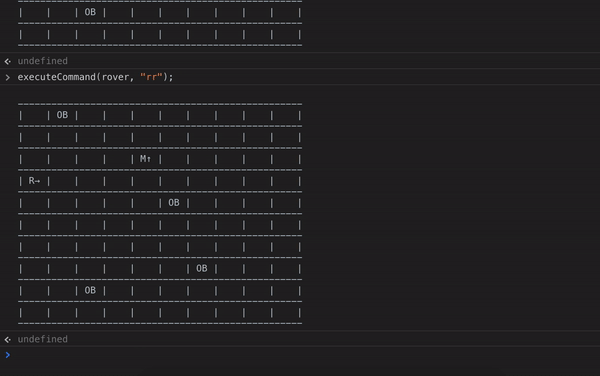

# Mars Rover

### Ejecutar instrucciones al robot

En el ejercicio he hecho el bonus 2 y existen dos robots.
Para asignar las instrucciones a cada robot hay que pasar el nombre del robot por parámetro.

Robot 1: `rover`

Robot 2: `mars`

Para ejecutar un comando de instrucciones en el Rover

```javascript
executeCommand(rover, "rrfflfff");
```

Para ejecutar un comando de instrucciones en el Mars

```javascript
executeCommand(mars, "ffrfff");
```

### Gif demostración



### Autor

Sofía Nombela